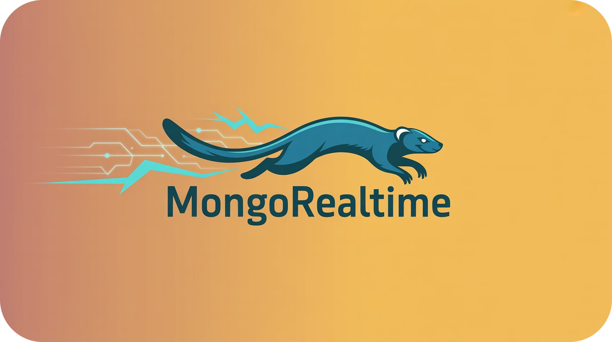

# MongoRealtime 🚀

A Dart package that allows you to listen in real-time to changes in a MongoDB database via a bridge with the Node.js package [`mongo-realtime`](https://www.npmjs.com/package/mongo-realtime).



## Features

- Listen to insert, update, delete, replace, drop events on MongoDB collections.
- Filter events by collection or specific document ID.
- Stream changes as Dart events.
- Easily manage multiple listeners.
- Lightweight and efficient.

## Getting Started

### 1. Install the Dart Package

Add `mongo_realtime` to your `pubspec.yaml` or via:

```bash
dart pub add mongo_realtime
```

### 2. Set Up the Node.js Bridge (optional)

This package relies on a Node.js bridge using [mongo-realtime](https://www.npmjs.com/package/mongo-realtime).

Install it with (on the server):

```bash
npm install mongo-realtime
```

Create a simple Node.js server:

```js
const MongoRealtime = require("mongo-realtime");

// ...server initialization and db connection

// then init realtime with the same connection and server
MongoRealtime.init({
  uri: mongoose.connection,
  server: server,
});
```

Make sure your MongoDB instance is a **replica set**.

==**IMPORTANT NOTE :**== If your server is not using the mongo-reatime package, it should emit [db events](#db-events) itself through a socket.

### 3. Use in Dart

#### Basic usage

```dart
import 'package:mongo_realtime/mongo_realtime.dart';

void main() async {
  MongoRealtime.init("http://my_server:server_port", showLogs: false);

  // After calling init(), you can use MongoRealtime.instance or the getter 'kRealtime'

  final listener = MongoRealtime.instance.db().onChange(
    callback: (change) => print("Change: ${change.collection}"),
  );

  // connect to the server when autoConnect is false
  MongoRealtime.instance.connect(); // or kRealtime.connect();

  // Stop listening:
  listener.cancel();
}
```

See [api overview](#api-overview) for more details.

#### Using auth token

```dart
MongoRealtime.init(
  "http://my_server:server_port",
  token : "my_jwt_token", // or any string
  autoConnect: true, // default is false
  authData: {"role": "admin"}, // optional additional data
);
```

This will send the token to the server before connecting. The server can then verify it and accept or reject the connection.

#### Using multiple instances

```dart
final prodServer = MongoRealtime(
  "http://prod-server-url",
  onConnect: (s) {
    print("Connected to prod server");
  },
);
final devServer = MongoRealtime(
  "http://dev-server-url",
  onConnect: (s) {
    print("Connected to dev server");
  },
);

// Listen to changes
prodServer.col("users").onChange(
  callback: (change) => print("users changed on prod"),
);
devServer.col("posts").onChange(
  callback: (change) => print("posts changed on dev"),
);
```

#### Specific use cases

```dart
//  Listeners

kRealtime.col("users").doc("1234").onChange(types: [MongoChangeType.insert]); // when got a new user with id 1234

kRealtime.db(["notifications", "posts"]).onChange(types: [MongoChangeType.delete]); // when delete a notification or post

kRealtime.db().onChange(types: [MongoChangeType.drop]); // when drop any collection

kRealtime.listStreamMapped<String>(
  "usersWithName",
  fromMap: (doc) => doc["name"],
  filter: (value) {
    return value.toString().startsWith("A");
  })
.listen((s) => print(s)); // Stream of list of documents from "users" collection

```

#### Using streams instead of callback

```dart
void doSomething(change) {}
void doSomethingOnStream(change) {}

final listener = kRealtime.col(
  "notifications").onChange(
  types: [MongoChangeType.insert],
  callback: doSomething,
); //new notification

listener.stream.listen(doSomethingOnStream);

// Both functions will be called doSomething and doSomethingOnStream when changes
```

#### Listening to specific events

You can listen to any event (even [db events](#db-events) or [list stream events](#list-stream-events)) on the socket juste like with socket.io

```dart
kRealtime.socket.on("custom-event", (data) {});
kRealtime.socket.on("db:update:users:1234", (data){}); // when user 1234 changes
```

## API Overview

- `MongoRealtime.init(url,...)`: Connect to your bridge server.
- `MongoRealtime.forceConnect(...)`: Force connect to the server after some retries.
- `db(...)` : Instance of `MongoRealtimeDB`.
- `col(...)` :Instance of `MongoRealtimeCol`.
- `listStreamMapped<T>(...)` : Stream of list of mapped objects from a collection.
- `listStream(...)` : Stream of list of documents from a collection.
- `MongoRealtimeDB.col(...)` : Same as `MongoRealtimeDB.col(...)`.
- `MongoRealtimeCol.doc(...)` : Instance of `MongoRealtimeDoc`.
- `MongoRealtimeDB.onChange(...)`: Listen to one or many collections.
- `MongoRealtimeCol.onChange(...)`: Listen to a collection changes.
- `MongoRealtimeDoc.onChange(...)`: Listen to doc changes.

Each listener provides:

- `stream`: A `Stream<MongoChange>`.
- `cancel()`: To remove the listener.

### DB Events

#### 1st level : `db:$operation_type`

- `db:change`
- `db:insert`
- `db:update`
- `db:delete`
- `db:drop`
- `db:replace`
- `db:invalidate`

#### 2nd level : `$1st_level:$collection`

- `db:change:users`
- `db:insert:posts`
- ...

#### 3rd level : `$2nd_level:$document_id`

- `db:update:users:XYZ`
- `db:delete:posts:229`
- ...

### List Stream Events

- `db:stream:{streamId}`

## License

MIT License
